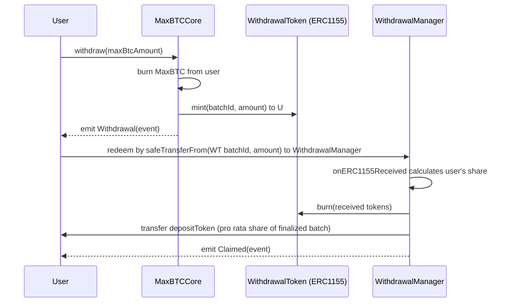

# MaxBTC Overview


## Architecture Diagram
```mermaid
flowchart LR
  %% Tokens
  subgraph Tokens [Tokens]
    MBT["MaxBTCERC20 (ERC20Upgradeable)"]
    WDT["WithdrawalToken (ERC1155Upgradeable)"]
  end

  %% Core and supporting contracts
  subgraph Core [Core & Services]
    CORE["MaxBTCCore"]
    RC["Receiver (ExchangeRateProvider)"]
    FC["FeeCollector"]
    WM["WithdrawalManager"]
    WAIT["Waitosaur (Time-lock manager)"]
    WH_OBS["WaitosaurHolder / WaitosaurObserver"]
  end

  %% Relationships
  CORE -->|mints / burns| MBT
  CORE -->|queries exchange rate| RC
  CORE -->|collects fees| FC

  WM -->|"issues withdrawal tokens (batched)"| WDT
  WDT -->|represents withdrawal batches| WM
  WM -->|requests funds / finalization| CORE

  WAIT -->|manages time-locked ops| WM
  WH_OBS -->|manages time-locked ops| WM
  ```

## User Deposit Flow

```mermaid
sequenceDiagram
  participant U as User
  participant C as MaxBTCCore
  participant D as DepositToken (WBTC)
  participant R as Receiver (ExchangeRateProvider)
  participant T as MaxBTCERC20

  U->>C: deposit(amount, recipient, minReceiveAmount)
  C->>R: getTwaer() (exchange rate + lastUpdated)
  R-->>C: rate, lastUpdated
  C->>C: validate rate freshness & deposit cap
  C->>C: computeMintAmount(amount, rate, depositCost)
  C->>C: enforce slippage (minReceiveAmount)
  C->>D: safeTransferFrom(user -> core, amount)
  D-->>C: transfer successful
  C->>T: mint(recipient, maxBtcToMint)
  T-->>U: tokens minted (balance increases)
  C-->>U: emit Deposit(event)

```

## User Withdrawal Flow



## Ticks flow

```mermaid


```

